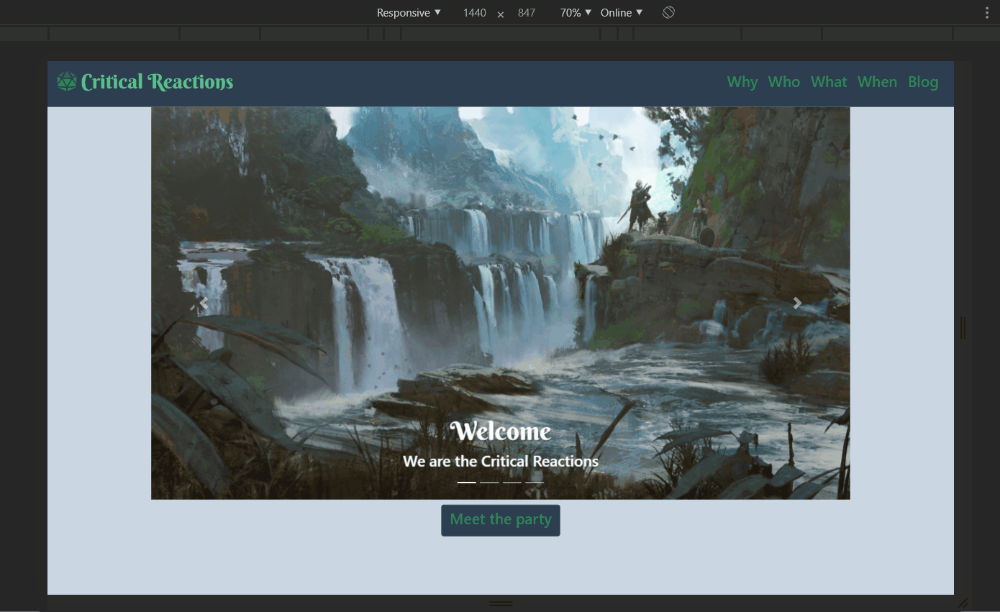

# Critical Reactions!
### The ultimate resource for Faerun's best known adventuring party, Critical Reactions!
A marketing site for my DnD Party.


The inspiration is somewhere close to what a Real Estate or Insurance agent may use to sell customers on their service. Get to know us, read about our previous trials, customer testimonials, and more! The internet is the next big magical phenomenon to come to Faerun!

### App v.1



The plan with this is to make a Django and Vue.js fullstack application. The backend will be simple, but I want to expand it later. For now, the focus will be on seeing what I can do with Sass and Vue Components to make a sharp front-end. I would like to add a blog and a service inquiry form to the backend later. 

This is built using Django and DjangoREST hooked up to Vue.js on the front end. The styling utilizes BootstrapVue and Sass. This is my first time using Bootstrap. I try not to use libraries too much in this "learning" stage of my career change, as I like to try and build things from scratch when possible to understand how they work. I've been interested in Sass, and once I saw how Bootstrap and Sass worked together, it blew my mind! Also, the built-in responsivness is SOOO nice. 

*All of the flavor text on the site has been compiled with the collaboration of fellow player, Marika (Aella Picazo, Ranger). Please be patient as we work on this hobby. This will directly affect the completion of the Testimonials component. *


## Future Features of the Project

  - Add a blog section for the party's bard to share lavish tales from the road. 
  
  - Gather testimonials from previously satified customers to boast our ability.

  - Provide an inquiry form so that prospective citizens in need can sumbit help requests at their convenience that the party can check from anywhere and follow-up with info on when they will be available to help.  

***

# How to Download and Run This App:

## The Backend

This project uses virtual environments with pipenv. With pipenv installed, create the virtual environment:

```console
~/critical-reactions
$ pipenv shell
```

'Sync' to install the project's dependencies:

```console
~/critical-reactions
$ pipenv sync
```

***

## The Frontend

This project uses yarn for frontend dependencies:

```console
~/critical-reactions
$ cd crit-vue/

~/critical-reactions/crit-vue
$ yarn install
```

***

## Serve it

Now you will need two seperate terminals to run each chunk of the project. Make sure you are in the correct folders. 

###  Backend Server

If you are not serving on localhost:8000, the AJAX urls will fail. 
```console
~/critical-reactions

$ python manage.py runserver localhost:8000
```

### Frontend Server

```console
~/critical-reactions/crit-vue
$ yarn serve
```
It will then tell you the url for your browser. It is commonly http://localhost:8080/

```console
App running at:
  - Local:   http://localhost:8080/
  - Network: http://10.0.0.225:8080/
```

